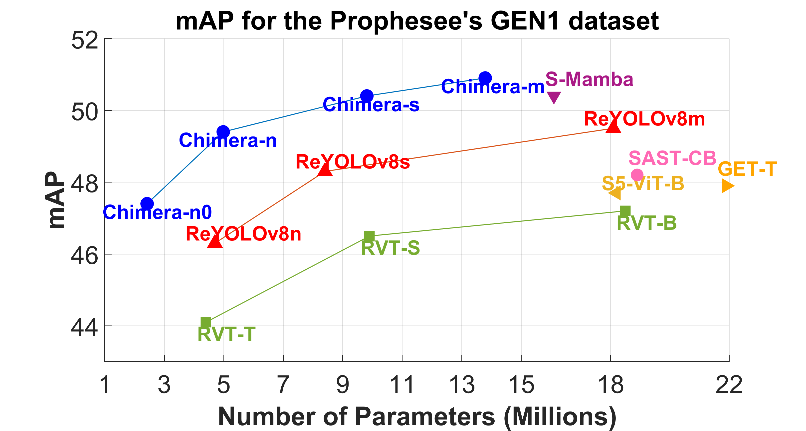

# Chimera - NAS for Event-Based Object Detection

This repository contains the source code for "Chimera: A Block-Based Neural Architecture Search Framework for Event-Based Object Detection", accepted for publication in the Frontiers in Artificial Intelligence journal. <br/>
 <br/>
You can read the full paper on: <br/>
[Outdated Arxiv Paper - to be updated soon](https://arxiv.org/pdf/2412.19646?) <br/>

# Setting up the environment 
```
conda env create -f chimera_env.yml <br/>
```

# Evaluating the final architectures from the paper

First of all, you need to open the "yaml" file for the corresponding dataset you want to test and modify the paths to the location you are using.
Then, you can run:
```
 python val.py --data ${DATASET}.yaml --model ${WEIGHTS}.pt --channels 5 --split ${SPLIT} --show_sequences ${SEQ}
```

**SPLIT**: val, test <br />
**DATASET**: You can find the "yaml" files inside the "data" folder. Example: "data/gen1/gen1_shist.yaml" <br />
**WEIGHTS**: They are stored in the "weights" folder. Example: "weights/gen1/chimera-n0-gen1.pt" <br />
**SEQ**: number of sequences you want to see the predictions, default is 3 

# Training 

# Single-gpu
```
python train.py --batch ${BATCH} --nbs ${BATCH//2} --epochs ${NUM_EPOCH} --data ${DATASET}.yaml  --model ${MODEL_NAME}.yaml --channels ${CH} --name ${WANDB_RUN_NAME} --project ${WANDB_PROJECT_NAME}  --hyp ${HYP}.yaml --zoom_out ${Z} --flip ${F} --val_epoch ${VAL_EPOCH} --clip_length ${CLIP_LENGTH} --clip_stride ${CLIP_STRIDE}
```
where:

**BATCH**: Batch size <br />
**NUM_EPOCH**: Number of epochs <br />
**MODEL_NAME**: The "yaml" files are stored inside the folder "models". Example: "models/chimera-n0.yaml" <br />
**CH**: Number of channels. In all the experiments in this work, this number was set to 10. <br />
**HYP**: The "yaml" files for the hyperparameters are stored inside the folder "hyps". It contains some hyperparameters such as learning rate, weight decay, momentum, and the loss function multipliers. Example: "hyps/hyp_gen1.yaml" <br />
**F**: Horizontal flip probability <br />
**Z**: Zoom-out probability <br />
**VAL_EPOCH**: Number of epochs to perform validation <br />
**CLIP_LENGTH**: Length of the clips used for training <br />
**CLIP_STRIDE**: Distance between different clips. If equal to CLIP_LENGTH, clips will not present overlap.

To accelerate the training, we adopted some tricks:  <br />
**1-** We validated only at each 10 epochs <br />
**2-** During training, instead of running the validation steps on full sequences, we divided the **val** set into batches that can be processed faster. <br />
**3-** On the training pipeline, only the final validation step over the **test** set is calculated over full sequences. <br />
**4-** Values reported in the paper that refer to the **val** set come from running **val.py** after training <br />

The factor **--nbs** stands for Normalized Batch Size. It is also present in the original Ultralytics repo and is utilized to make the training more robust to different batch sizes. Accordingly, 
the Weight Decay was set taking into consideration the **nbs** and the **clip length** according to:

```
W_Decay = W0*Batch_size*Clip_Length/NBS
```
Where **W0** is the weight decay defined in the hyperparameter files and **W_Decay** is the one adopted during training (and reported in the paper)

# Multi-gpu
```
torchrun --nnodes 1  --nproc_per_node ${GPUS}  train.py --device ${LIST_OF_GPUS} --batch ${BATCH} --nbs ${BATCH//2} --epochs ${NUM_EPOCH} --data ${DATASET}.yaml  --model ${MODEL_NAME}.yaml --channels ${CH} --name ${WANDB_RUN_NAME} --project ${WANDB_PROJECT_NAME}  --hyp ${HYP}.yaml --zoom_out ${Z} --flip ${F} --val_epoch ${VAL_EPOCH} --clip_length ${CLIP_LENGTH} --clip_stride ${CLIP_STRIDE}
```
where:
**GPUS**: The number of GPUs in your node <br />
**LIST_OF_GPUS**: The list of the devices from your node. For example, for three GPUs, use [0,1,2] <br />


